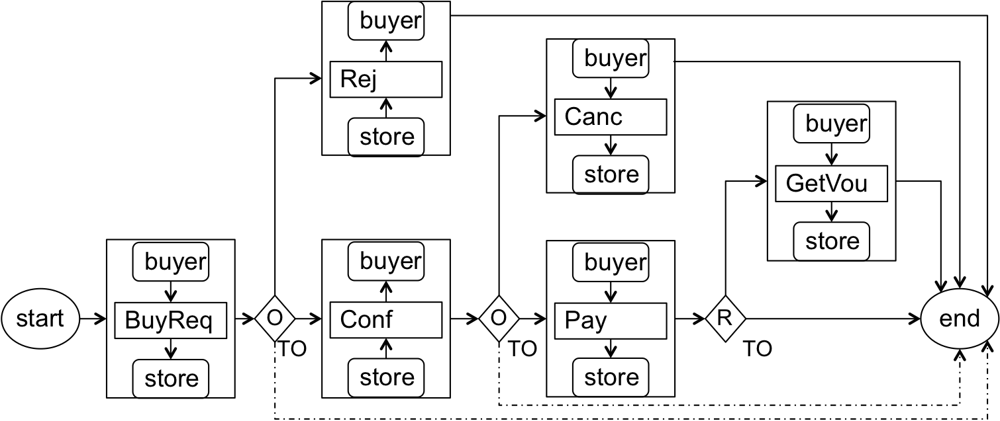

# contraval (smart contract validation)

This repository hosts **epromela** ---a tool for
building models of smart contracts that can
be validated by the Spin model checker.
 

### Validate your smart contracts before deployment
A particularity of smart contracts deployed on--blockchain 
is that because of their descentralisation and openess, 
they are hard to amend after deployment. Therefore, we 
suggest that smart contracts are thoroughly validated 
(for example, using conventional model checking tools) 
to uncover potential logical inconsistencies of their clauses 
(omissions, contradictions, duplications, etc.). In addition, 
we suggest that the actual implementation is systematically 
tested before deployment. In hybrid architectures 
(see for example,
[Implementation of Smart Contracts Using Hybrid Architectures with On- and Off-Blockchain Components](https://arxiv.org/pdf/1808.00093.pdf "implementation paper"))
that include on and off--blockchain components the risk of 
implementing buggy is exacerbated by the interaction between 
the the components.

 

An example of business contract between a *buyer* and
a *store* that includes typical 
operations is shown in the figure bellow. 

  

### What can Epromela do with smart contracts?
Epromela is a language for writing models that
can be model checked by the Spin model checker. 

We have built it by extending the standard Promela language
with primitives that help developers build
models of smart contracts using constructs that
are natural to smart contracts. Examples of
these constructs are *role players, such as
buyer and seller*, *rights*,
*obligations* and *prohibitions*; and operations
such as *assign obligation to pay 
to buyer*, *has buyer fulfilled obligation to pay?*,
*cancel buyer's obligation to pay*,
etc. 

An epromela model can be presented to Spin 
for **model checking** and **generating test 
cases (execution sequences)**.

### Model checking 
 Spin can verify the logical consistency of the model
 epromela of the smart contract against correctness 
 properties written 
 in LTL (Linear Temporal Logics) formulae.  

### Generation of execution sequences (test cases) 
 Spin can be instructed to generate all the execution
 sequences encoded in the epromela model of the
 smart contract. The basic idea is to use Spin as a
 generator of counterexamples produced against 
 LTL formulae.

### Execution model of bilateral operations with potential exceptions 
A salient feature of epromela is that it can model
exceptions on the basis of the following execution model:
 

Contractual operations are bilateral in the sense that
their execution requires the interaction of the two
business partners. 
Upon completion of the execution of a given operation
each party independently declares its local outcome:
success, business failure (bizfail) or technical 
failure (tecfail).

Since the parties operate in a loosely coupled mode,
their outcomes does not necessarily match. For instance
a party might declare success whereas its counterpart
declares business failure.

To agree on the outcome of each operation and be able
to progress to the next one in harmony, the parties
rely on an output synchronizer that is responsible for 
receiving the individual outcomes, compute a single
outcome and notify it to the contractual parties and
possibly to other parties that are entitled to
follow the execution of the contract.

An schematic view of the execution model is
shown in the following figure.

  

In the figure, *oper* stands for contractual operation, such as
*BuyReq*, *Pay*, *Conf*, etc.

### Business event generator 
At the heart of epromela lies a Business Event Generator
(BEG) that is responsible for generating the business events
generated by the contractual parties when they execute
a contractual operation.

To reduce the number of states of the model, the BEG abstracts 
away the communication between the contracting parties and
plays the role of the output synchronizer as shown in the
figure.
 

  

The event generated by the BEG are sent to a set of business rules
for evaluation for contract compliance.

# Installation

The directions for installation of epromela are documented in
the [UserGuide_v1.2.pdf](./UserGuide_v1.2.pdf) file. The document
also includes examples that demonstrate its operation.

# Contributors

*  Abubkr A. Abdelsadiq developed the macros as part of his
   PhD dissertation (2012) at University of Newcastle, UK.
*  Ionnis Sfyrakis from University of Newcastle, UK
   (Ioannis.Sfyrakis@newcastle.ac.uk) implemented 
   the Python parsers to extract execution sequences during his
   Masters degree (2012) at Newcastle.
*  Carlos Molina from University of Cambridge 
   (Carlos.Molina@cl.cam.ac.uk) implemented shell scripts to 
   mechanise the extraction of execution sequences. He has been
   maintaining, documenting and testing the tool.

# Bug reporting and comments

Feel free to email 
[carlos.molina + @ + cl.cam.a.uk](mailto:carlos.molina@cl.cam.ac.uk) 
if you have comments, bugs to report or questions.

# Licence
The contraval tool is released under the Apache License, 
Version 2.0 which is available from Apache’s web pages.
 
